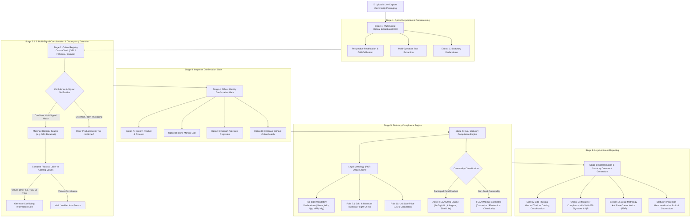
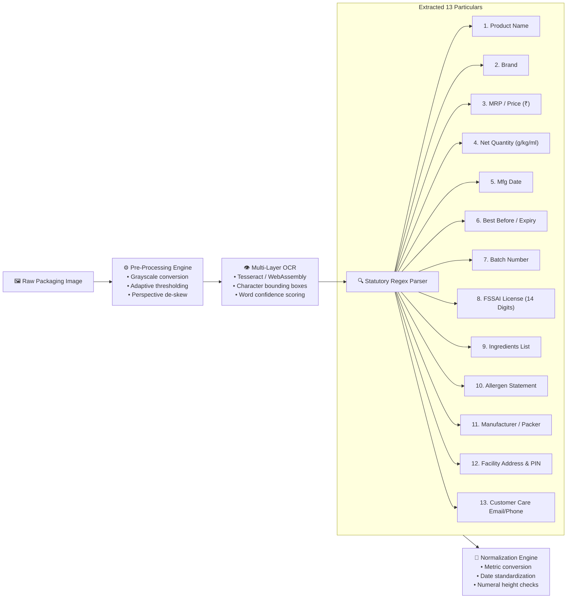
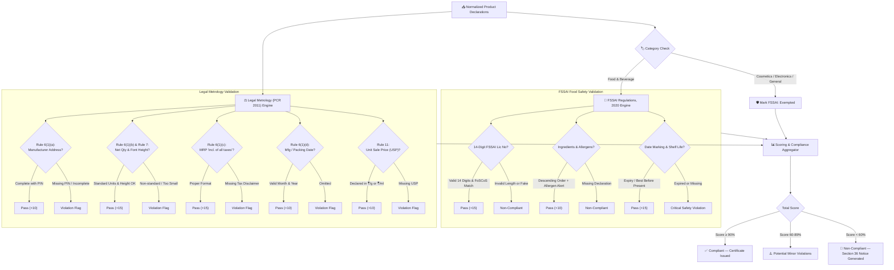

# 🛡️ LabelGuard AI

### **Autonomous Legal Metrology & FSSAI Label Compliance Enforcement System**
*Developed for Smart India Hackathon (SIH) — Ministry of Consumer Affairs, Food & Public Distribution*

---

[](https://sih.gov.in)
[](https://consumeraffairs.nic.in)
[](https://fssai.gov.in)
[](https://react.dev)
[](https://www.typescriptlang.org)
[](https://vitejs.dev)

---

## 📌 Executive Summary

Current prototype scanners often **hallucinate** or **guess** company names, product variants, and Maximum Retail Prices (MRP) when packaging images are low-resolution, angled, or torn. Furthermore, many generic checkers apply arbitrary rules without category awareness and silently overwrite physical label values with random online data.

**LabelGuard AI** solves this with an **Evidence-First Multi-Signal Verification Architecture**:
> **Core Principle:**  
> **`Identify → Extract → Verify → Confirm → Check Rules → Generate Report`**  
> *Do not guess. Do not silently overwrite. Always show statutory evidence.*

---

## 🔄 System Architecture & Workflow Charts

### 1. High-Level End-to-End Inspection Pipeline


---

### 2. Optical OCR & 13-Field Extraction Pipeline


---

### 3. Dual Regulatory Decision Engine (PCR 2011 vs FSSAI 2020)


---

### 4. Enforcement & Show-Cause Notice Generation Workflow
```mermaid
flowchart TD
    SCORE["⚖️ Compliance Engine Assessment"] --> DECISION{"Any Statutory Violations?"}
    
    DECISION -->|All Mandatory Rules Satisfied| CERT["📜 Generate Certificate of Compliance\n• Unique Certificate ID\n• SHA-256 Digital Verification Hash\n• Embedded Inspection QR Code"]
    
    DECISION -->|Rule Violations Detected| NOTICE["🚨 Automated Section 36 Notice Engine"]
    
    subgraph SC ["Show-Cause Notice Generation"]
        NOTICE --> N1["Extract Statutory Offenses\n(e.g., Rule 6(1)(a) No PIN, Rule 6(1)(c) No Taxes Declared)"]
        NOTICE --> N2["Map to Section 36(1) of Legal Metrology Act, 2009"]
        NOTICE --> N3["Calculate Compounding Fee / Fine Bracket"]
        NOTICE --> N4["Generate Legal Show-Cause Summons PDF"]
    end

    CERT --> ARCHIVE["📁 Departmental Digital Inspection Archive"]
    SC --> ARCHIVE

---

## 🏛️ The 6-Stage Operational Pipeline

### **Stage 1: Multi-Signal Optical Extraction (OCR)**
* Never guesses or fabricates product names, company titles, MRPs, or license numbers.
* Simultaneously parses 8 visual signals from physical packaging:
  1. **Brand Name / Commercial Mark**
  2. **Generic / Specific Commodity Name**
  3. **Manufacturer / Packer / Importer Name & Postal Address with PIN Code** (Rule 6(1)(a))
  4. **Maximum Retail Price (MRP)** and *"inclusive of all taxes"* statement (Rule 6(1)(c))
  5. **Net Quantity** in standard metric units ($g$, $kg$, $ml$, $l$) (Rule 6(1)(b))
  6. **Schedule II Font Size / Numeral Height** (Rule 7)
  7. **Unit Sale Price (USP)** (Rule 6(11))
  8. **Month & Year of Manufacture / Packing** (Rule 6(1)(d))

---

### **Stage 2: Online Registry Cross-Check (`IProductVerificationService`)**
* Modular, pluggable architecture designed to connect to authoritative external databases (GS1 India DataKart, Open Food Facts, or brand registries).
* In demo mode, clearly stamped as **“Demo verification data (mock service)”** — no fake URLs or simulated internet crawls.
* Cross-checks using multi-field matching:
  $$\text{Match Signals} = \text{Brand} + \text{Product Name} + \text{Barcode/GTIN} + \text{Net Qty} + \text{MRP}$$
* Issues five statutory verification statuses:
  - `Verified from source`
  - `Partially matched`
  - `Conflicting information`
  - `Not found`
  - `Manual verification required`

---

### **Stage 3: Strict Separation of Ground Truth vs Verified Data**
* **Section A (Extracted from Uploaded Label)**: Retains raw OCR readings as primary legal ground truth for statutory inspection.
* **Section B (Online Verification)**: Corroborates secondary catalog records.
* **No Silent Overwrites**: If the physical label says ₹120.00 and an online listing says ₹110.00:
  - Both values are explicitly displayed side-by-side.
  - A **Conflicting Information Alert** is logged.
  - The physical label value is preserved for enforcement determination.

---

### **Stage 4: Product Identity Confirmation Gate**
Before any legal evaluation is executed, the user or enforcement officer must review the confirmation modal:
- **Displays**: Label Image, Detected Brand, Detected Product Name, Barcode, Online Match, and Confidence Score.
- **Controls**:
  - `Confirm Product & Proceed`
  - `Edit Details` (inline manual correction of misread OCR text)
  - `Search Again` (re-query product databases)
  - `Continue Without Online Verification` (flags record as: *“Identity not confirmed — manual verification required”*)

---

### **Stage 5: Category-Aware Compliance & Food-Only FSSAI Module**

#### **A. Legal Metrology (Packaged Commodities) Rules, 2011 (Amended)**
- Applied based on packaging type, category, and net quantity thresholds:
  - **Rule 6(1)(a)**: Complete manufacturer/packer address with mandatory postal PIN.
  - **Rule 6(1)(b) & Rule 7**: Standard metric net quantity declarations meeting minimum Schedule II numeral heights.
  - **Rule 6(1)(c)**: MRP in ₹ inclusive of all taxes (flags non-compliant suffixes like *+ Local Taxes*).
  - **Rule 6(11)**: Mandatory Unit Sale Price (USP) per $g$, $kg$, or $ml$.
  - **Rule 6(1)(f)**: Complete Consumer Care Redressal Cell (Designation, Phone, Email, Address).

#### **B. FSSAI Food Label Compliance (FSS Regulations, 2020)**
- **Evaluated EXCLUSIVELY for packaged food products**:
  - **Regulation 5(1)**: 14-digit FSSAI License Number & Official Logo.
  - **Regulation 5(2)**: Specific Food Product Name & Category.
  - **Regulation 5(3)**: Descending order ingredient declaration.
  - **Regulation 5(4)**: Allergen warning statements.
  - **Regulation 5(5)**: Nutritional Information Panel (Energy, Protein, Carbs, Sugars, Sodium).
  - **Regulation 5(6)**: Veg / Non-Veg Green/Brown Logo.
  - **Regulation 5(10)**: Date marking (*Best Before* / *Expiry*).
  - **Regulation 5(13)**: Customer Care & Grievance Cell.
- **Non-Food Commodity Exemption**: Cosmetics (shampoos, lotions), electronics, and cleaning products are exempted from FSSAI checks with an official exemption tag.

---

### **Stage 6: Honest Audit Determinations & Statutory Documents**

#### **Honest Result Categories** (No generic "100% compliant" banners):
1. `Compliant based on configured checks`
2. `Potential violation`
3. `Needs manual verification`
4. `Product identity not confirmed`
5. `Insufficient evidence`

#### **Statutory Documents Generated (1-Click Print / PDF)**:
- **Official Certificate of Statutory Compliance**: Issued for compliant packaging with SHA-256 digital signature hash, inspection ID, and dynamic verification QR code.
- **Section 36 Legal Metrology Show-Cause Notice**: Statutory charge sheet citing Section 36(1) of the Legal Metrology Act, 2009 for compounding or summons.
- **Digital Compliance Inspection Memorandum**: 8-point inspection memo for court and department archives.

---

## 🧪 Interactive Demo Scenarios (For SIH Evaluators)

| Test Metric | **Demo 1: Confirmed Food Commodity** | **Demo 2: Uncertain / Torn Label** | **Demo 3: Non-Food Cosmetic** |
| :--- | :--- | :--- | :--- |
| **Product** | *NutriSnack Roasted & Salted Almonds* | *Unidentified Herbal Formulation* | *Sparkle Glow Herbal Shampoo* |
| **Commodity Type** | Packaged Food (`Food & Snacks`) | General Commodity | Personal Care & Cosmetics |
| **OCR Signals** | Complete, crisp, high-confidence (98%) | Incomplete, blurred, torn (15–42%) | Stamped label, missing tax wording |
| **Online Registry** | GS1 DataKart / National Catalog | No reliable catalog match (0%) | Matched online catalog (88%) |
| **Confirmation Gate** | Confirmed by officer | Identity Not Confirmed warning | Confirmed by officer |
| **FSSAI Module** | **Active** (All 8 declarations passed) | Excluded (Identity unconfirmed) | **Exempted** (Non-Food Product) |
| **Determination** | `Compliant based on configured checks` | `Product identity not confirmed` | `Needs manual verification` |

---

## 💻 Tech Stack & Architecture

- **Frontend**: React 19, TypeScript 5.8, Tailwind CSS (Vanilla utilities + Glassmorphism design system)
- **Tooling & Bundling**: Vite 6.2 (production bundle under 600 kB gzipped)
- **Icons & Visuals**: Lucide React, Custom SVG vector assets
- **Compliance Engines**: Modular TypeScript classes (`complianceEngine.ts`, `productVerificationService.ts`)
- **Theme Engine**: Light & Dark mode support with zero-overflow viewport containment

---

## 🚀 Quick Start Guide

### Prerequisites
- Node.js (v18.0.0 or higher)
- npm or yarn

### Installation & Execution
```bash
# 1. Clone the repository
git clone https://github.com/RiteshSingh7311/PROTOTYPE-.git

# 2. Navigate to project directory
cd PROTOTYPE-

# 3. Install dependencies
npm install

# 4. Start local development server
npm run dev

# 5. Build production bundle (Verification)
npm run build
```

Open [http://localhost:5173/](http://localhost:5173/) in your browser to test the live application.

---

## 👥 Smart India Hackathon 2026 Team
- **Project Title**: LabelGuard AI
- **Problem Statement**: Automated Verification of Legal Metrology (Packaged Commodities) Rules & Food Safety Declarations
- **Repository**: [https://github.com/RiteshSingh7311/PROTOTYPE-.git](https://github.com/RiteshSingh7311/PROTOTYPE-.git)

